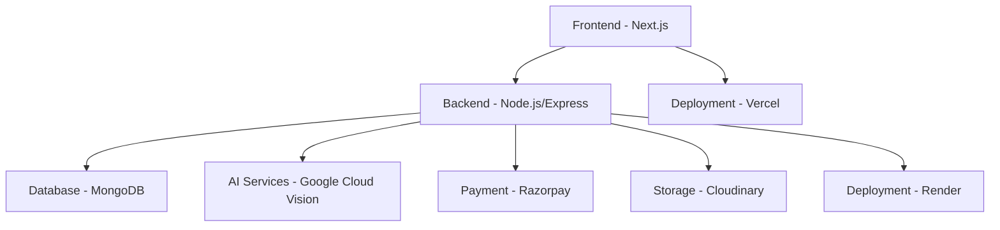

# 🛍️ ReTag Marketplace

<div align="center">


**India's Smartest Thrift Store**  
*Sell Smart. Buy Better. ReTag.*

[](https://nextjs.org/)
[](https://www.typescriptlang.org/)
[](https://nodejs.org/)
[](https://www.mongodb.com/)
[](https://cloud.google.com/)

[🚀 Live Demo](https://retag-beta.vercel.app) • [📖 Documentation](#documentation) • [🤝 Contributing](#contributing)

</div>

---

## 🌟 Overview

ReTag Marketplace is an innovative AI-powered thrift store platform that revolutionizes the second-hand clothing industry. By combining artificial intelligence with modern e-commerce, we create a trustworthy, efficient, and sustainable marketplace for pre-owned fashion.

### ✨ Key Features

- 🤖 **AI-Powered Pricing** - Automated price suggestions using Google Cloud Vision API
- 🔍 **Quality Assessment** - Computer vision-based condition analysis
- 🛒 **Complete E-commerce** - Cart, wishlist, and secure checkout
- 💳 **Payment Integration** - Razorpay gateway with order management
- 📱 **Responsive Design** - Mobile-first approach with PWA capabilities
- 🔐 **Secure Authentication** - JWT tokens + Google OAuth 2.0
- 👨‍💼 **Admin Dashboard** - Product approval and management system

## 🎯 Problem Statement

The second-hand clothing market faces critical challenges:
- **Pricing Inconsistency** - Sellers struggle with fair valuation
- **Quality Uncertainty** - Buyers lack trust in product condition
- **Manual Processes** - Time-intensive listing and approval workflows
- **Limited Transparency** - Poor product presentation affects sales

## 💡 Our Solution

ReTag addresses these challenges through:
- **AI-Driven Automation** - Intelligent pricing and quality assessment
- **Standardized Metrics** - Consistent condition scoring and evaluation
- **Professional Presentation** - High-quality product listings
- **Trust Building** - Transparent processes and verified quality

## 🏗️ Architecture



## 🛠️ Tech Stack

### Frontend
- **Framework:** Next.js 14 with App Router
- **Language:** TypeScript
- **Styling:** Tailwind CSS
- **UI Components:** Shadcn/UI
- **State Management:** React Context API

### Backend
- **Runtime:** Node.js
- **Framework:** Express.js
- **Database:** MongoDB with Mongoose ODM
- **Authentication:** JWT + Passport.js
- **File Storage:** Cloudinary

### AI & Integration
- **Computer Vision:** Google Cloud Vision API
- **Payment Gateway:** Razorpay
- **Email Service:** Custom SMTP integration
- **Image Processing:** Sharp + Cloudinary

### DevOps & Deployment
- **Frontend Hosting:** Vercel
- **Backend Hosting:** Render
- **Database:** MongoDB Atlas
- **Version Control:** Git + GitHub

## 🚀 Getting Started

### Prerequisites
- Node.js 18+ and npm
- MongoDB database
- Google Cloud Vision API credentials
- Razorpay account for payments

### Installation

1. **Clone the repository**
   ```bash
   git clone https://github.com/divanshu-1/retag.git
   cd retag
   ```

2. **Install dependencies**
   ```bash
   # Frontend
   cd studio
   npm install
   
   # Backend
   cd ../server
   npm install
   ```

3. **Environment Setup**
   
   Create `.env` files in both `studio` and `server` directories:
   
   **Frontend (.env.local):**
   ```env
   NEXT_PUBLIC_API_URL=http://localhost:8080
   NEXT_PUBLIC_RAZORPAY_KEY_ID=your_razorpay_key
   ```
   
   **Backend (.env):**
   ```env
   MONGO_URI=your_mongodb_connection_string
   JWT_SECRET=your_jwt_secret
   GOOGLE_CLIENT_ID=your_google_oauth_client_id
   GOOGLE_CLIENT_SECRET=your_google_oauth_secret
   RAZORPAY_KEY_ID=your_razorpay_key_id
   RAZORPAY_KEY_SECRET=your_razorpay_secret
   CLOUDINARY_CLOUD_NAME=your_cloudinary_name
   CLOUDINARY_API_KEY=your_cloudinary_key
   CLOUDINARY_API_SECRET=your_cloudinary_secret
   ```

4. **Start Development Servers**
   ```bash
   # Backend (Terminal 1)
   cd server
   npm run dev
   
   # Frontend (Terminal 2)
   cd studio
   npm run dev
   ```

5. **Access the Application**
   - Frontend: http://localhost:9002
   - Backend API: http://localhost:8080

## 📱 Features Showcase

### 🏠 Landing Page
- Modern hero section with clear value proposition
- Featured products grid with hover effects
- Category navigation and search functionality

### 🤖 AI-Powered Selling
- Drag-and-drop image upload
- Real-time AI analysis and pricing
- Quality assessment with confidence scores
- Automated categorization

### 🛒 Shopping Experience
- Responsive product catalog
- Advanced filtering and search
- Persistent cart and wishlist
- Seamless checkout process

### 💳 Payment & Orders
- Secure Razorpay integration
- Order tracking and management
- Email notifications
- Admin order oversight

### 👨‍💼 Admin Dashboard
- Product approval workflow
- User management
- Analytics and reporting
- Content management

## 🎨 Design System

- **Color Palette:** Modern dark theme with accent colors
- **Typography:** Inter font family for readability
- **Components:** Consistent design language
- **Responsive:** Mobile-first approach
- **Accessibility:** WCAG 2.1 compliant

## 🔒 Security Features

- **Authentication:** JWT tokens with refresh mechanism
- **Authorization:** Role-based access control
- **Data Protection:** Input validation and sanitization
- **Payment Security:** PCI DSS compliant processing
- **API Security:** Rate limiting and CORS protection

## 📊 Performance

- **Lighthouse Score:** 95+ across all metrics
- **Core Web Vitals:** Optimized for user experience
- **Image Optimization:** Automatic compression and WebP
- **Code Splitting:** Lazy loading and dynamic imports
- **Caching:** Strategic caching for optimal performance

## 📈 Project Stats


## 🗺️ Roadmap

### ✅ Completed (v1.0)
- [x] AI-powered pricing system
- [x] Complete e-commerce functionality
- [x] Payment gateway integration
- [x] Admin dashboard
- [x] Responsive design

### 🚧 In Progress (v1.1)
- [ ] Mobile app development
- [ ] Advanced analytics dashboard
- [ ] Social features and reviews
- [ ] Multi-language support

### 🔮 Future (v2.0)
- [ ] AR try-on features
- [ ] Blockchain authenticity verification
- [ ] Advanced recommendation engine
- [ ] Seller analytics and insights

## 🐛 Known Issues

- Image upload may be slow on poor network connections
- Some older browsers may have compatibility issues
- Mobile app is in development

## 📚 Documentation

- [API Documentation](docs/API.md)
- [Deployment Guide](docs/DEPLOYMENT.md)
- [Contributing Guidelines](CONTRIBUTING.md)
- [Code of Conduct](CODE_OF_CONDUCT.md)

## 🏆 Awards & Recognition

- **Best Internship Project** - TeqMavens 2024
- **Innovation in AI Integration** - Internal Recognition
- **Sustainable Technology Award** - Environmental Impact

## 🤝 Contributing

We welcome contributions! Please see our [Contributing Guidelines](CONTRIBUTING.md) for details.

### Development Workflow
1. Fork the repository
2. Create a feature branch (`git checkout -b feature/amazing-feature`)
3. Commit your changes (`git commit -m 'Add amazing feature'`)
4. Push to the branch (`git push origin feature/amazing-feature`)
5. Open a Pull Request

## 📄 License

This project is licensed under the MIT License - see the [LICENSE](LICENSE) file for details.

## 👥 Team

- **Developer:** [Divanshu Arora](https://github.com/divanshu-1)
- **Mentor:** Mr. Ajay Rana (Senior Project Manager, TeqMavens)
- **Organization:** [TeqMavens Pvt. Ltd.](https://www.teqmavens.com/)

## 🙏 Acknowledgments

- TeqMavens Pvt. Ltd. for internship opportunity and guidance
- Google Cloud Platform for AI services
- Open source community for amazing tools and libraries

## 📞 Contact

- **Email:** [your-email@example.com](mailto:your-email@example.com)
- **LinkedIn:** [Your LinkedIn Profile](https://linkedin.com/in/your-profile)
- **Portfolio:** [Your Portfolio Website](https://your-portfolio.com)

---

<div align="center">

**Made with ❤️ for sustainable fashion**

[⭐ Star this repo](https://github.com/divanshu-1/retag) • [🐛 Report Bug](https://github.com/divanshu-1/retag/issues) • [💡 Request Feature](https://github.com/divanshu-1/retag/issues)

</div>
